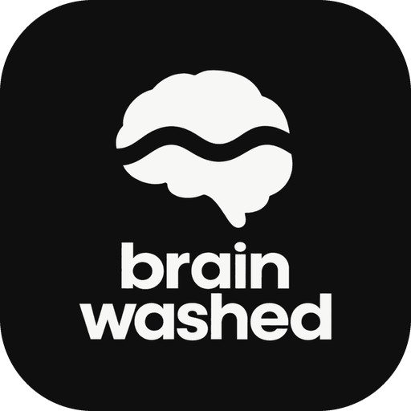

<p align="center"></p>

# BrainWashed

Turn your laptop into a private AI server, and use it from your phone or any browser, anywhere.

BrainWashed is one command, `brainwashed`. It runs open source language models on your own computer (macOS, Windows, Linux), lets you teach it new abilities by dropping in a markdown **skill** file, and serves a web app: chat for everyone, and admin pages to manage models, skills, devices, remote access and settings. Chats take pictures, PDFs and documents. Admins set thinking, temperature and reply length for everyone in Settings, and each chat can change them for itself. Admins can add MCP servers so models can use tools, like reading files or fetching web pages. When a local model isn't enough, admins can connect OpenAI, Anthropic, Gemini, OpenRouter or any OpenAI-compatible provider with their own API key. An OpenAI-compatible API lets scripts and other apps use the same models. A built-in secure tunnel makes it reachable from anywhere with no router setup. Optional iOS/Android apps connect to the same host. Your conversations stay end-to-end encrypted between your devices and hardware you own.

> **Support BrainWashed:** [donate through PayPal](https://www.paypal.com/pool/9tf5FyKDzU).

> **Status:** pre-release. See [install.md](docs/install.md) to try it, and the [architecture and roadmap](docs/architecture.md) for what's next.

## Install

- **Windows** (PowerShell): `irm https://raw.githubusercontent.com/ahmadalshouly/brainwashed/main/install.ps1 | iex`
- **macOS and Linux**: `curl -fsSL https://raw.githubusercontent.com/ahmadalshouly/brainwashed/main/install.sh | sh`

It starts right away and opens the admin page. Later, run `brainwashed`. [docs/install.md](docs/install.md) lists every command, including `brainwashed service install` to keep it running in the background.

On Windows 11, if loading a model fails with `0xc0e90002`, Smart App Control is blocking llama.cpp: see [Windows Smart App Control](docs/install.md#windows-smart-app-control).

## Repository layout

| Path | What it is |
|---|---|
| `crates/cli` | The `brainwashed` command: the host |
| `apps/web` | The web app the host serves: chat and admin pages |
| `packages/api` | TypeScript types and client for the host's client protocol |
| `crates/core` | The engine: models, llama.cpp runtime, skills and chat |
| `crates/skills` | Parser and loader for `SKILL.md` files |
| `crates/gateway` | The host's server: encrypted API for paired devices, roles, audit log, tunnel and relay connection |
| `crates/relay` | Relay server for using BrainWashed away from home ([docs](docs/relay.md)) |
| `builtin-skills` | Skills that ship with BrainWashed |
| `docs` | Architecture and design notes |

## Getting started

Prerequisites: Node 20+, pnpm 10 and Rust (stable).

```sh
pnpm install
pnpm web:build       # build the web app; debug builds of the host read it from disk
pnpm dev             # run the host (cargo run -p brainwashed-cli); add -- --help for options
pnpm typecheck && pnpm test && cargo test --workspace
```

## Skills

A skill is a folder with a `SKILL.md` file: YAML frontmatter describing it, followed by instructions in plain markdown.

```markdown
---
name: writing-assistant
description: Writes, rewrites and proofreads emails in the right tone.
triggers: [write an email, draft an email]
---
When the user wants an email written:
1. ...
```

How it works:

- Skills live in the data folder under `skills/`, one subfolder per skill (`brainwashed skills` shows where). Edit them on the admin page's **Skills** page or in any text editor; changes apply within seconds.
- Every enabled skill's `name` and `description` go into the system prompt as a short index.
- For each message the host picks at most two relevant skills and adds their full instructions. A `triggers` phrase in the message always selects a skill; otherwise skills are matched by the distinctive words they share with the message (and the previous message, so follow-ups keep their skill).
- Skills are never trained into the model, so a new skill works on the next message.

BrainWashed ships with two skills, in [`builtin-skills`](builtin-skills):

- **document-analyst** summarizes and answers questions about attached PDFs, Word files and text, quoting the document and never inventing facts.
- **writing-assistant** writes, rewrites and proofreads emails and messages in the right tone.

They are always installed and update with BrainWashed. Admins can turn them off, but not delete them. To customize one, save a copy under a new name and turn the original off.

### Community skills

People share skills in the [community registry](https://github.com/ahmadalshouly/brainwashed-skills) ([browse them](https://ahmadalshouly.github.io/brainwashed-skills/)). Install one from the **Community** tab on the **Skills** page, or from the terminal:

```sh
brainwashed skills search email
brainwashed skills install email-writer      # or a link to any SKILL.md
brainwashed skills update
```

You always see the whole skill before it's installed, along with anything that looks like an attempt to take over the model (`crates/skills/src/review.rs`). Community skills are pinned to the commit that was reviewed and checked against their SHA-256. An installed skill records where it came from in `origin.json` next to its `SKILL.md`; skills you changed locally are never updated without asking. To share one of your own, press **Share** next to it, which opens a prefilled pull request on the registry. Teams can run their own index and set it under **Settings → Community skills index**.

## Cloud models

Open **Cloud models** on the admin page, pick a provider (OpenAI, Anthropic, Google Gemini, OpenRouter, Groq, Mistral, DeepSeek, xAI, Together, Ollama on another machine, or any OpenAI-compatible API), paste an API key and choose which models to offer. They appear in the chat's model menu next to the local model. The key stays on your computer in `providers.json` and is never sent to devices; messages to a cloud model do leave your computer, and the chat says so whenever one is picked. Admins decide whether members may use each provider.

## Tools (MCP servers)

Models can use tools from [MCP servers](https://modelcontextprotocol.io): read and write files, fetch web pages, search, call APIs, anything an MCP server offers. Open **Tools** on the admin page and add a server as a command this computer runs (for example `npx -y @modelcontextprotocol/server-filesystem ~/Documents`, or `uvx mcp-server-fetch`) or as an address it reaches over HTTP (for example `https://example.org/mcp`, with headers such as `Authorization` if it needs a token). You can also paste the `mcpServers` JSON a server's instructions give for Claude Desktop or Cursor.

Each server has an on/off switch, and only admins' chats use it unless you share it with members. When a model that supports tools (its chat template says so, and cloud models do) calls one, BrainWashed runs it, hands the result back and lets the model carry on; the chat shows each call and what it returned. Servers are kept in `mcp.json`, readable only by your user. A command server runs with your account's access, so add only servers you trust. Small local models are hit-and-miss with tools; 7B and larger, or cloud models, do much better. The OpenAI-compatible API doesn't offer these tools: scripts bring their own.

## API

BrainWashed also speaks the OpenAI API, so any OpenAI client, script or app can use your models. Open **API** on the admin page, create a key, and use the address shown there (for example `http://localhost:47860/v1`) as the base URL. Replies get the same skills and chat defaults as the chat. See [docs/api.md](docs/api.md).

## Using it from your phone, another computer, or your team

No app is required: any browser works, at home or away.

1. On the admin page, open **Devices** and click **Show code**. Pick **member** (chat only) or **admin**.
2. Scan the QR code with the phone's camera, or open the link on another computer. It opens BrainWashed in the browser and connects it.
3. It stays connected until you remove it under **Devices**. The **Activity** page records who connected and every change admins make.

By default the code carries a free Cloudflare tunnel address, so it works from anywhere. For an address that never changes, use your own domain, Tailscale or a reverse proxy; see [docs/remote-access.md](docs/remote-access.md).

The optional BrainWashed iOS and Android apps, sold separately, scan the same code. Anyone can build their own client: the protocol is documented and versioned in [docs/client-protocol.md](docs/client-protocol.md), and `@brainwashed/api` implements it in TypeScript.

Messages are end-to-end encrypted with keys exchanged through the QR code, so the tunnel only ever carries ciphertext.

## Support the project

BrainWashed is free and open source. If it's useful to you, you can [donate through PayPal](https://www.paypal.com/pool/9tf5FyKDzU) to support its development. The admin panel links there too.

## Releasing

Maintainers: see [docs/releasing.md](docs/releasing.md).

## License

[Apache-2.0](LICENSE)
